# TokenTime Fund

Blockhain technlogy is relatively young. The trajectory of its adoption appears to be following that of the internet for retail and commercial applications, which in a span of 20 plus years, has become mainstream. 

A cryptographically secured chain of blocks was first described in 1991, and implemented in 2009 for bitcoin (see reference 1 below for more detail). The distributed ledger technology behind blockchain carries a number of benefits, and some risks (see references 2 below). In 2014, blockchain technology is being looked at for adoption in mainstream businesses, beyond cryptocurrencies (see references 3 and 4 below). The key benefits of blockchain platform are enhanced security, greater transparency, and instant traceability. It enables pier-to-pier (P2P) transactions with no intermediaries.

The scope of this project is as follows: 

* Develop a prototype plaform for launching a tokenized fund porfolio (see reference 5 below for more information on the concept of a tokenized porfolio). The fund could potentially invest in conventional non-crypto securities, with transactions being made in crypto currencies which are backed by fiat currencies (eg. USDC).

* Use Openzeppelin ERC20 standard fungible token libraries to deploy Solidity smart contracts for an Initial Coin Offering (ICO).

* Develop a  DApps using Python, Web3 library and Streamlit, to make it easier for the investors and fund managers to interact with the deployed solidity contracts. Tests are conducted using a local Ethereum Virtual Machine - Ganache.

* New tokens are minted as investors buy tokens with ethereum coins. Investors hold the tokens and the coins that are raised go into an Asset Under Management (AUM) wallet held by the fund manager. Investors have full real-time visibility of the AUM, the total token supply and the conversion rate. The performance of the fund is reflected by the conversion rate between tokens and coins. If the fund performs well, each token will be worth more coins, and vice versa. An investor can sell tokens back to the fund manager at any time based on the conversion rate. Tokens sold back to the fund manager go into the 'burn' wallet, and coins go back to the investor wallet. To ensure the number of coins and the AUM are 'balanced' so that the conversion rate is not distorted, the tokens in the burn wallet have to be disposed off to remove them from the total token supply. This prototype has a manual burn process. In actual implementation, the burn process is automated and executed as an investor sells tokens back to the fund manager. 

 

---

## Usage

First, download the files from Github into a folder, keeping the directory structure.

1. Start Ganache and launch an Etherium blockchain test network.

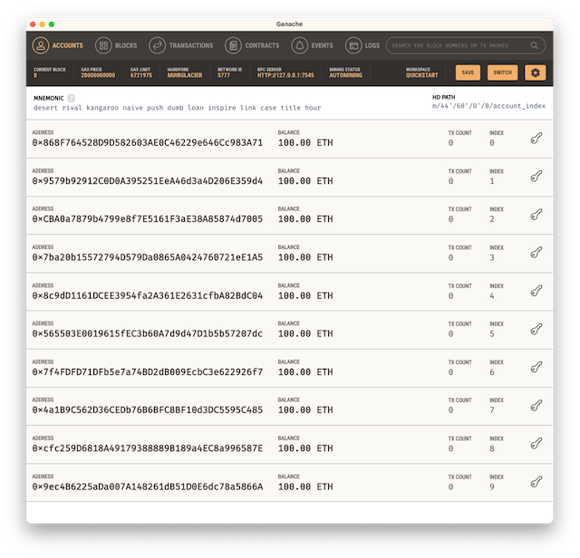
Use of accounts from Ganache:
* Account 0 - not used
* Account 1 - Fund Manager wallet dummy wallet to help simulate Asset Under Management (AUM) increase/decrease
* Account 2 - Fund Manager wallet for deploying contracts using Remix and Metamask
* Account 3 - Fund Manager wallet AUM / wei raised
* Account 4 - Fund Manager wallet for tokens bought back from investors, to be burnt
* Account 5 to 9 - Investors accounts

 

2. Create two smart contracts in [Remix](https://remix.ethereum.org). Go to the [Remix](https://remix.ethereum.org) website, create two new smart contracts and copy/paste the codes from the TokenTimeFund.sol and TokenTimeFundCrowdsale.sol files. Compile both .sol files and deploy the TokenTimeFundCrowdsaleDeployer smart contract. TokenTimeFundCrowdsaleDeployer is in TokenTimeFundCrowdsale.sol. When deployed, the TokenTimeFundCrowdsaleDeployer will automatically deploy the TokenTimeFundCrowdsale and TokenTimeFund contracts.

 

3. Connect Remix to Ganache Account2 through MetaMask to prepare for deploying the contracts. In MetaMask, import Account2, then select 'Injected Provider - MetaMask'. Make sure Account2 is selected in MetaMask before clicking next. This will connect Account2 in Ganche to Remix. Note: MetaMask has first to be connected to Ganache by adding the Ganache network into Metamask manually. This is not shown.
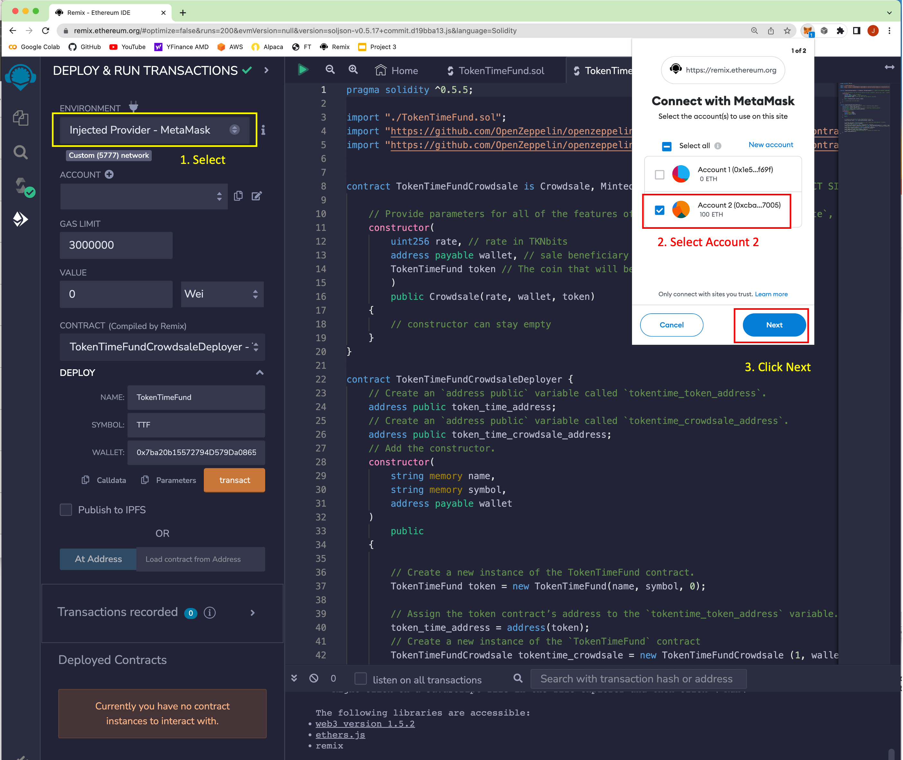

 

4. Deploy TokenTimeFundCrowdsaleDeployer.
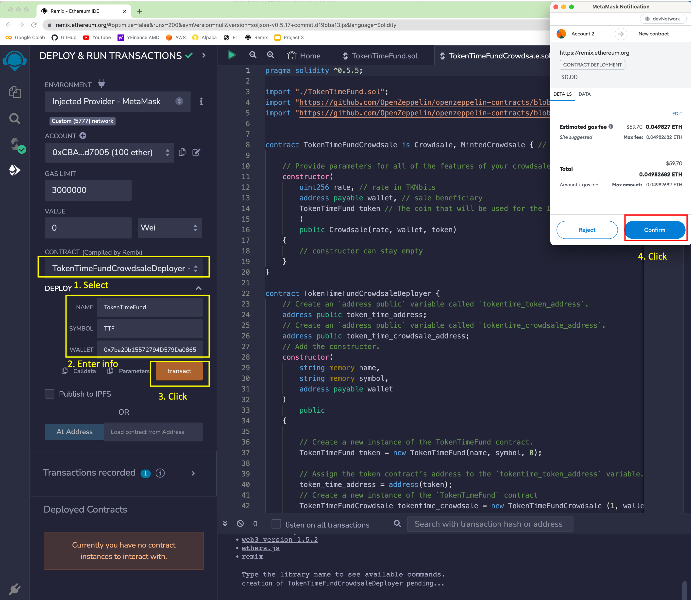

 

4. Deployed contracts
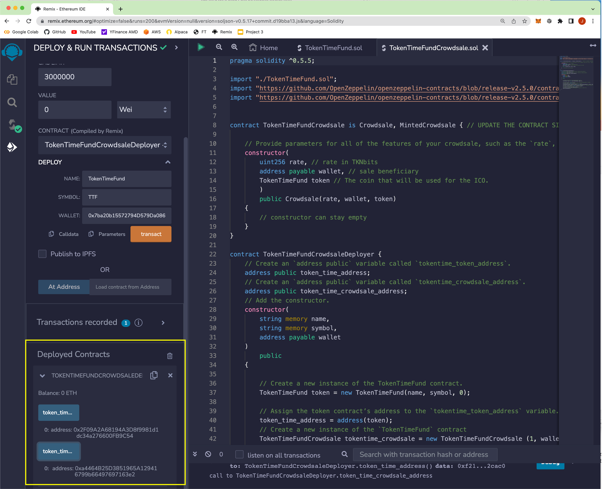

 

5. Update ttf.env environment file with the contracts addresses
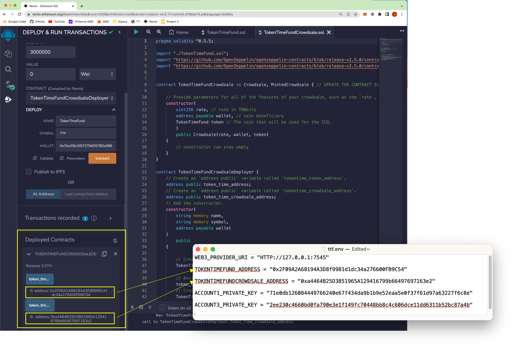

 

5. Update ttf.env environment file with the private keys of Accounts  1 and 3 in Ganache
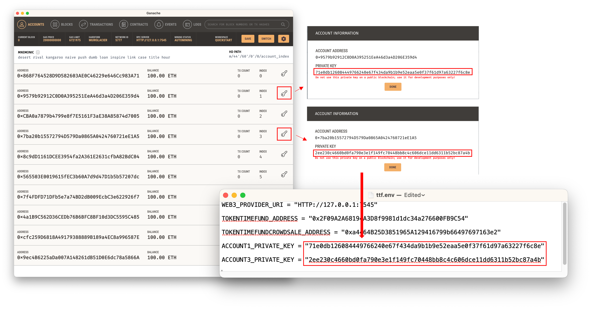

 

6. Launch app.py by issuing command 'streamlit run app.py' in terminal. Make sure terminal is in the right folder for the application.
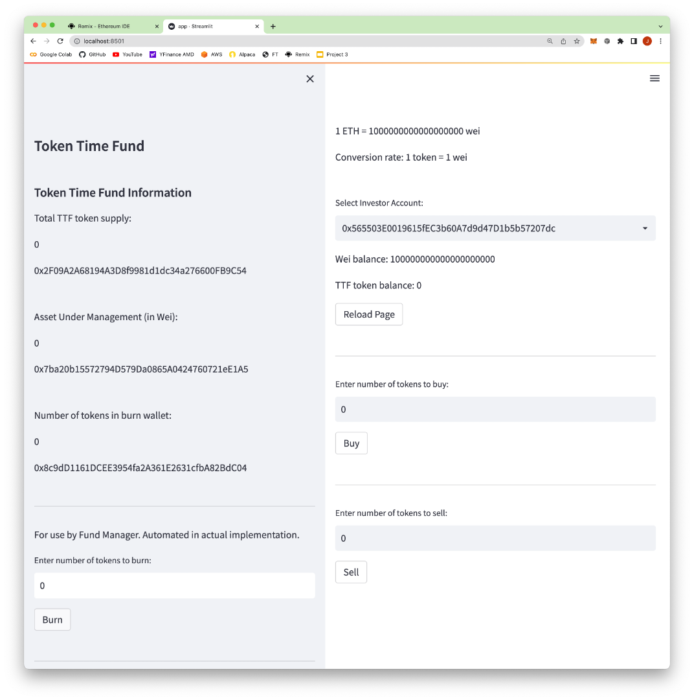

 

7.  Information on application webpage in relation to deployed contracts and Gananche accounts
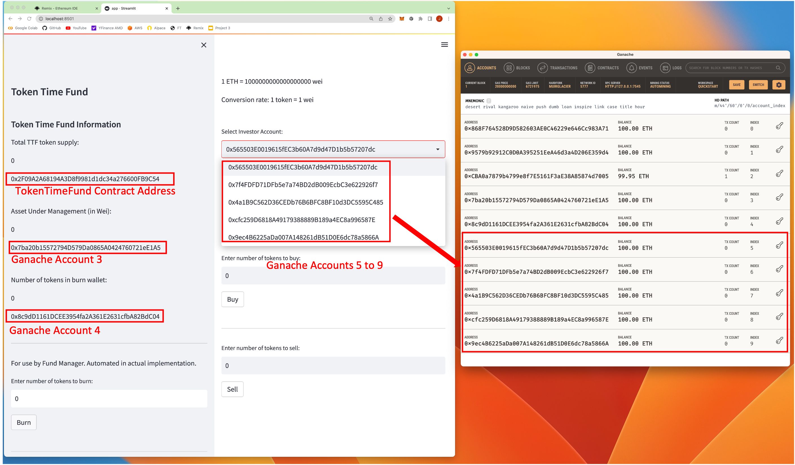

 

8. Execute a buy by Investor Account 5. New tokens are minted.
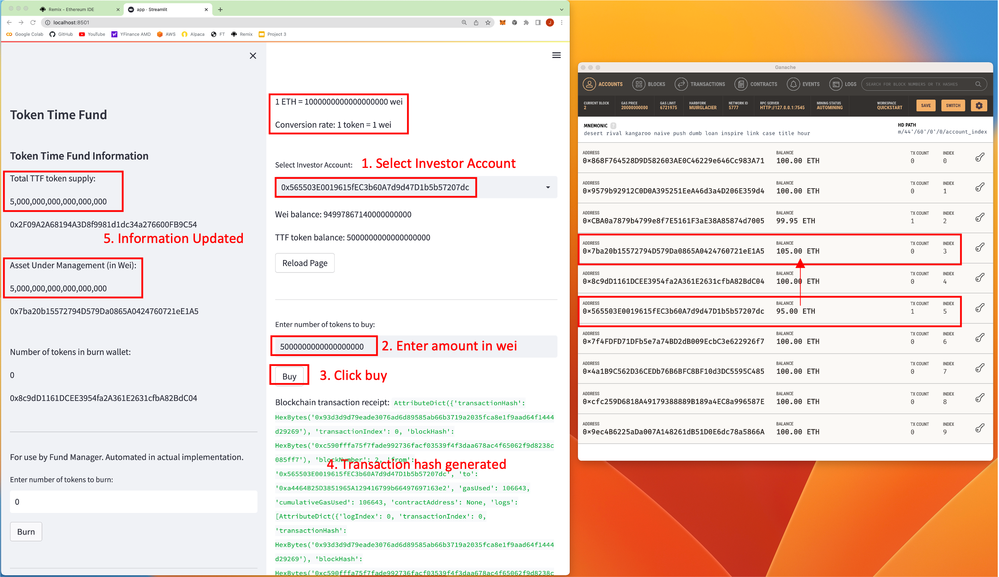

 

9. Execute a buy by Investor Account 6. New tokens are minted.
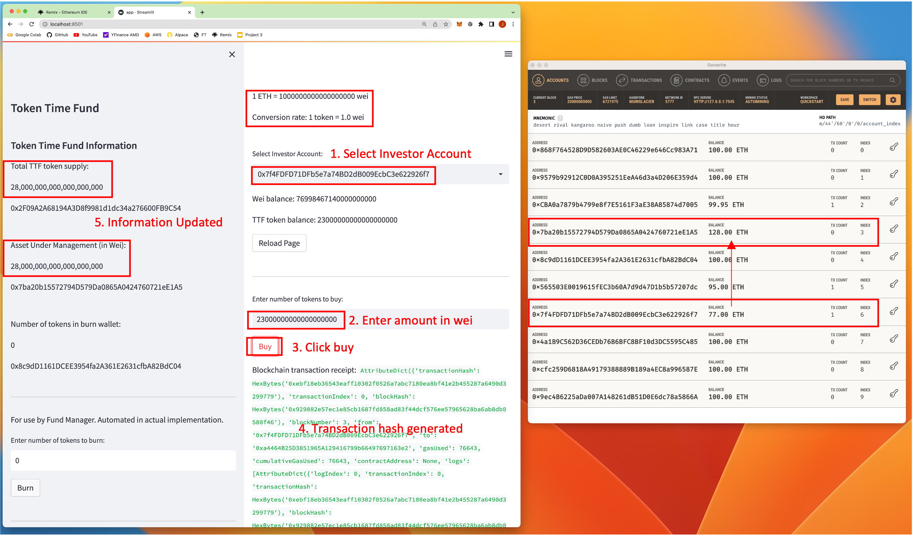

10. Simulate an increase in AUM due to positive fund investment activities
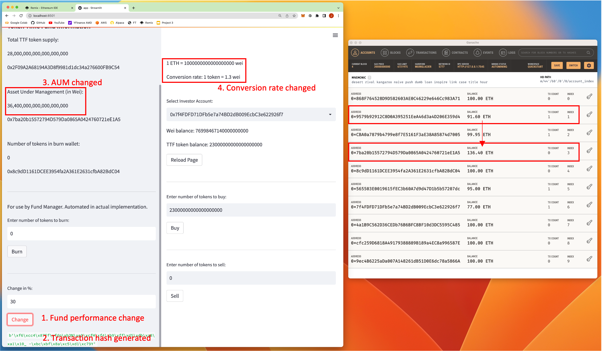

11. Execute a sell by Investor Account 6
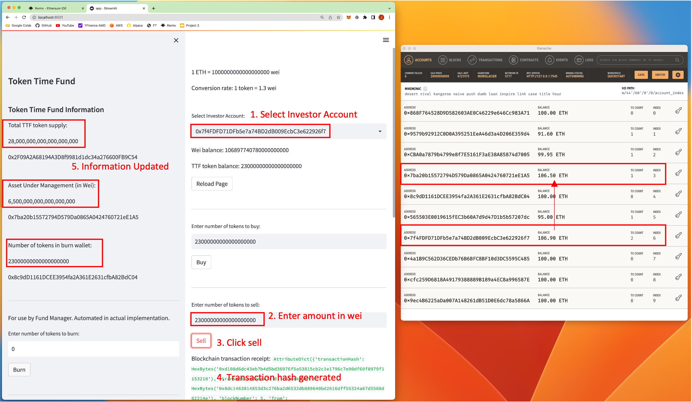

12. Conversion rate incorrect because total token supply is not in line with the AUM due to the tokens in the burn wallet, which is still counted in the total token supply
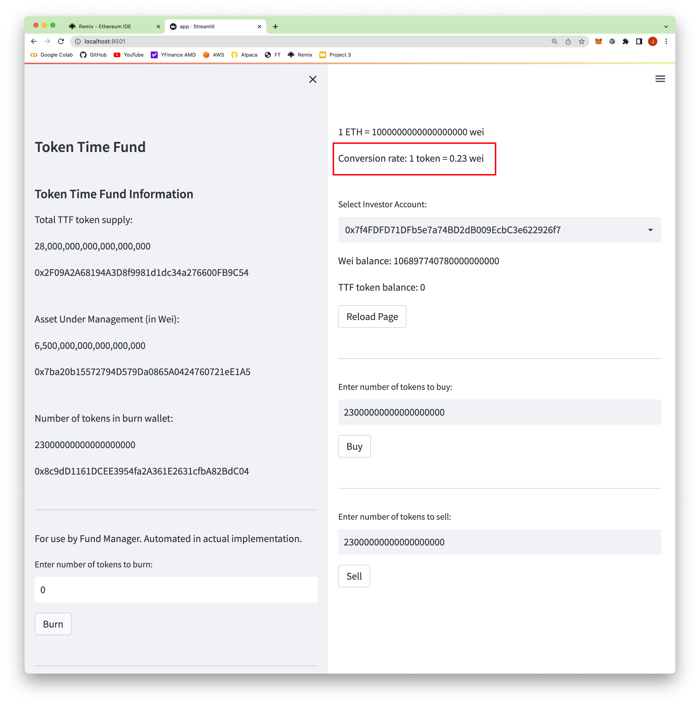

13. Once tokens in the burn wallet are 'burnt', the total token supply comes in line with the AUM and the conversion rate is now correct. This illustrates the process of minting through burning tokens in a tokenized portfolio platform.
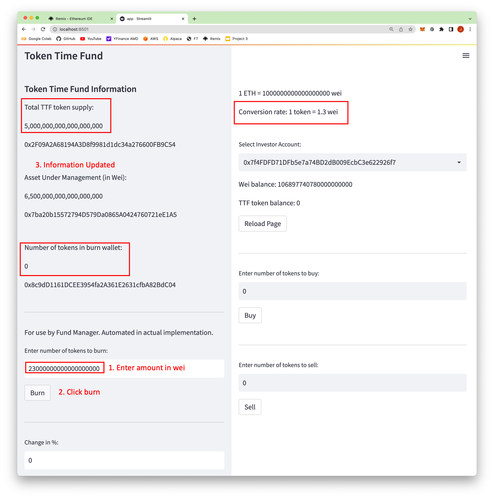

---

## Technologies

This application uses the following technologies:

ERC20 standards fungible tokens Solidity contracts
* [OpenZeppelin ERC20](https://docs.openzeppelin.com/contracts/4.x/erc20)

Remix is used for developing, compiling and deploying the Solidity smart contracts
* [Remix](https://remix.ethereum.org)

Ganache is used as the 'local' Ethereum blockchain network for testing purpose
* [Ganache](https://trufflesuite.com/ganache/)

MetaMask is used as the interface between Ganache and Remix
* [MetaMask](https://metamask.io)

Streamlit is used enable the python app to display in a web page format
* [Streamlit](https://streamlit.io)

Python Web3 libraries is used to connect Ganache to the application
* [Web3](https://pypi.org/project/web3/)

---
## Contributors

This application is written by James Tan, Patrick Ball, Jimmy Chow and Matthew Ho.

---

## License

MIT License.

---

References:

1. [History of Blockchain](https://www.icaew.com/technical/technology/blockchain-and-cryptoassets/blockchain-articles/what-is-blockchain/history)

2. [Risks And Benefits Of Blockchain Adoption](https://101blockchains.com/blockchain-adoption-risks-and-benefits/)

3. [Top 10 benefits of blockchain technology for business](https://www.techtarget.com/searchcio/feature/Top-10-benefits-of-blockchain-technology-for-business)

4. [IBM - Building trust and boosting the bottom line with Blockchain for Business](https://www.ibm.com/topics/benefits-of-blockchain)

5. [What Are Tokenized Portfolios, and How Do They Work?](https://cointelegraph.com/news/q-a-what-are-tokenized-portfolios-and-how-do-they-work)